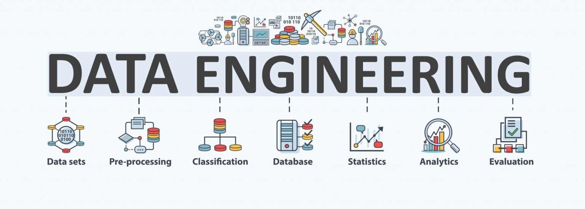

Welcome to Data Engineering Workspace!!!
========================================

Data Engineering
----------------

**Overview**Data Engineering is at the heart of data-driven decision-making, enabling efficient data collection, storage, and transformation. In this workspace, we focus on delivering scalable, secure, and optimized data pipelines that power analytics, machine learning, and business intelligence applications.

**Key Features**

*   **Data Pipeline Design & Automation**: Building robust data pipelines for ETL (Extract, Transform, Load) processes using tools like Apache Airflow, AWS Glue, and Google Dataflow.
    
*   **Data Warehousing**: Managing large-scale, distributed data warehouses and databases with platforms like Amazon Redshift, Google BigQuery, and Snowflake for efficient data storage and retrieval.
    
*   **Data Lake Management**: Implementing scalable and flexible data lakes using cloud storage solutions such as Amazon S3, Azure Data Lake, and Google Cloud Storage to support structured and unstructured data.
    
*   **Stream Processing**: Enabling real-time data processing and analytics using Apache Kafka, Apache Flink, or AWS Kinesis to process large volumes of streaming data.
    
*   **Big Data Frameworks**: Leveraging big data frameworks like Apache Hadoop and Apache Spark to process and analyze massive datasets.
    
*   **Data Quality & Governance**: Ensuring high data quality through validation, auditing, and implementing governance policies to maintain compliance and accuracy.
    
*   **Business Intelligence & Reporting**: Powering business analytics through integrations with BI tools like Tableau, Power BI, and Looker to derive actionable insights from data.

