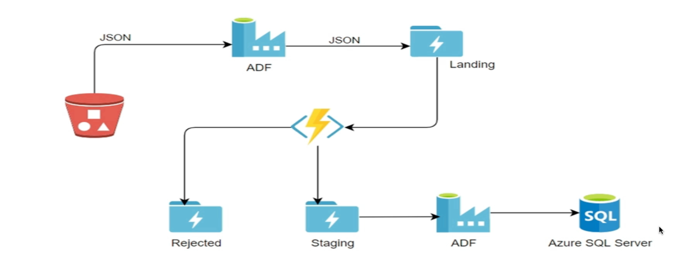

Smart Vehicle Project
=====================

Overview
--------

The **Smart Vehicle** project is designed to handle JSON data coming from IoT devices, stored in an AWS S3 bucket. This data is processed through an ETL pipeline using Azure services, ensuring proper validation and storage of the incoming data for further analysis.

Architecture
------------

*   **Source**: IoT devices send JSON data, which is stored in an AWS S3 bucket.
    
*   **ETL Process**: The pipeline fetches, validates, and organizes the data using Azure Data Factory (ADF) and Azure Blob Storage.
    

Workflow
--------

### 1\. Fetching Data from AWS S3

*   ADF is used to pull JSON files from the S3 bucket into a **landing directory** in Azure Blob Storage.
    

### 2\. Data Validation using Azure Blob Trigger

*   An **Azure Blob trigger function** is triggered when the JSON file is placed in the landing directory.
    
*   The function checks if the file has a valid format:
    
    *   **Valid Files**: Moved to the **staging folder**.
        
    *   **Invalid Files**: Moved to the **rejected folder**.
        

### 3\. Moving Data to Azure Data Lake Storage (ADLS)

*   Another pipeline is triggered when files appear in the **staging folder**.
    
*   This pipeline moves the files from the staging folder to **Azure Data Lake Storage (ADLS)** for further processing or analysis.
    

Technologies Used
-----------------

*   **Azure Data Factory (ADF)**: For orchestrating the data movement and transformation.
    
*   **Azure Blob Storage**: For storing and triggering functions based on file placements.
    
*   **Azure Functions**: For validating JSON file formats.
    
*   **Azure Data Lake Storage (ADLS)**: For storing processed data.
    
*   **AWS S3**: For storing the original JSON data from IoT devices.
    

Conclusion
----------

This project demonstrates an end-to-end ETL solution for handling IoT data from AWS S3 to Azure, ensuring reliable data validation and storage using Azure services.

