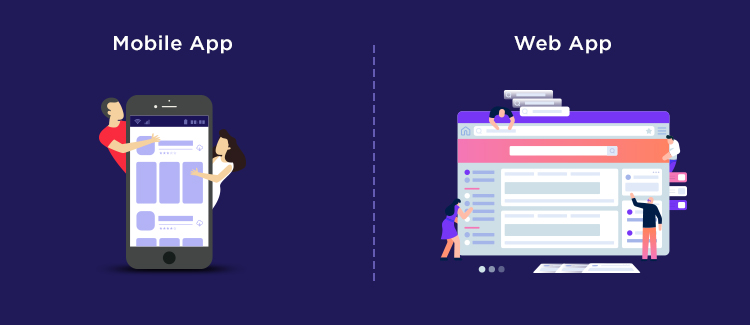

Welcome to Web & Mobile App Development Workspace!!!
====================================================

Web & Mobile App Development
----------------------------

**Overview**Web and mobile applications are the gateways to user engagement, providing immersive and intuitive experiences. In this workspace, we focus on delivering full-cycle solutions for developing modern, responsive web and mobile applications, from concept to deployment.

**Key Features**

*   **Cross-Platform Mobile Development**: Building feature-rich mobile applications for iOS and Android using frameworks like React Native, Flutter, and Swift.
    
*   **Web Development**: Crafting responsive, user-friendly websites and web apps using cutting-edge technologies like React, Angular, and Vue.js.
    
*   **Backend Services & APIs**: Developing scalable, secure, and high-performance backends using Node.js, Python (Django/Flask), and Ruby on Rails. Creating and managing APIs for seamless communication between services.
    
*   **UI/UX Design**: Designing sleek, intuitive user interfaces and experiences that enhance engagement and usability across platforms.
    
*   **Performance Optimization**: Ensuring fast loading times and smooth interactions through performance tuning and optimization techniques.
    
*   **Testing & Debugging**: Implementing comprehensive testing strategies, including unit tests, integration tests, and end-to-end tests, to ensure bug-free, reliable applications.
    
*   **Continuous Delivery & Deployment**: Streamlining the development lifecycle through CI/CD pipelines, enabling rapid iteration and deployment to production.

